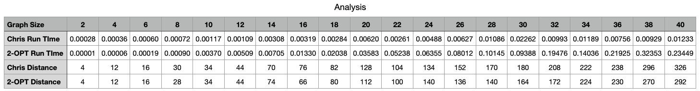
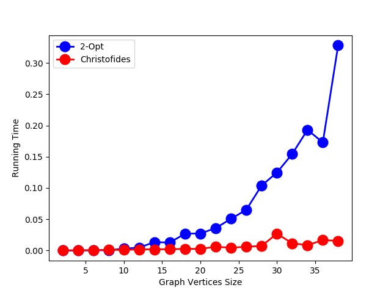
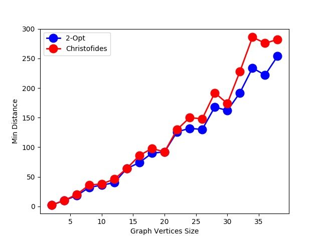

## Comparison For 2 Algorithm

Luzhe Sun 

2022.04.11

I test the graph size from 2 to 40 with step 2, to compare the efficiency of Christofides' algorithm and 2-opt algorithm.

The **Conclusion** is, when the graph is very small, both algorithm gives very confident result, and 2-OPT run even slightly faster than Chris. 

With the growth of the graph size, 2-OPT runs much lower, the times increase in exp time, while the run time for Chris slightly change in linear.

However, With the growth of the graph size, 2-OPT always gives better TSP circle, which means shorter distance. But the Chris also gives a good result, which is not far away from 2-OPT.

So **in practice**, I will choose Chris ALO, since it runs much faster than 2-OPT while the result is acceptable.

See comparison below:

