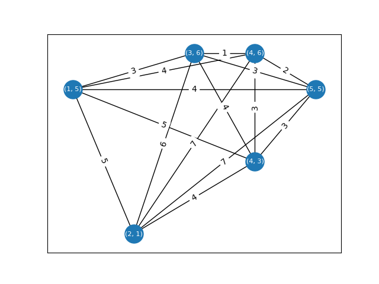

# Travelling Salesman

In the well-known [travelling salesman problem](https://en.wikipedia.org/wiki/Travelling_salesman_problem),
the goal is to find a minimum-weight Hamiltonian cycle in a weighted graph.
There are many variants: in the *symmetric TSP* the graph is undirected, 
in the *asymmetric TSP* the graph is directed and edges (u, v) and (v, u) can have different weights
(or one may not exist at all). Usually, we assume the graph is complete.

All versions of TSP are NP-hard (reduce from Hamiltonian cycle), 
so we usually apply heuristics or approximation algorithms (heuristics with guarantees).

We will consider the *metric TSP*, in which the weight function is a [metric](https://en.wikipedia.org/wiki/Metric_(mathematics)):
- `w(x, y) > 0` for all `x != y`
- `w(x, y) = w(y, x)` (symmetric)
- `w(x, z) <= w(x, y) + w(y, z)` (triangle inequality)

This is analogous to real-life distances. 

Below is an example using the [taxicab metric](https://en.wikipedia.org/wiki/Taxicab_geometry) (Manhattan distance).
The optimal solution has a total weight of 18.

## Christofides' algorithm

[Christofides' algorithm](https://en.wikipedia.org/wiki/Christofides_algorithm) is an approximation algorithm for 
the metric TSP with a 3/2 approximation ratio. Published in 1976, it is one of the earliest and most famous approximation algorithms. 
Surpassing its approximation ratio has been a longstanding goal which was only 
[recently achieved](https://www.quantamagazine.org/computer-scientists-break-traveling-salesperson-record-20201008/) by a tiny margin.

In `main.py`, implement Christofides' algorithm. The steps are given on Wikipedia.
For the step which involves finding a minimum weight matching, you may use `nx.min_weight_matching`.
*Do not use `nx.algorithms.approximation.traveling_salesman.christofides`*.

## 2-opt

[2-opt](https://en.wikipedia.org/wiki/2-opt) (pairwise exchange) is a simple TSP algorithm which works as follows:
1. Start with an arbitrary Hamiltonian cycle.
2. Consider all pairs of edges (a, b), (c, d) in the current cycle which do not share endpoints (all 4 nodes should be distinct).
3. For each pair of edges, look at the effect of swapping them for two other edges, (a, c) and (b, d).
4. Make the pairwise exchange which yields the largest reduction in weight.
5. Repeat steps 2-4 until the current cycle cannot be improved anymore.

2-opt is generally considered a heuristic, although it does achieve a √(V/2) approximation ratio for metric TSP. 
Despite this weak guarantee, it is very competitive with Christofides' algorithm. 
In `main.py`, implement the 2-opt algorithm.

## Analysis

Finally, you should perform a comparative analysis of your two algorithms. Generate inputs of various sizes using the `generate_metric_graph` function and run both algorithms. Which achieves lower total weight? Which has better runtime? Plot the solution cycle weight and runtime of both algorithms as a function of graph size (number of nodes). Create a file called `comparison.md` and write up your results, including the plots. Summarize any conclusions - which algorithm would you choose in practice?

## Testing

This week's automated test cases use [TSPLIB](http://comopt.ifi.uni-heidelberg.de/software/TSPLIB95/), a collection of TSP sample instances with known optimal solutions. The raw data is stored in the `data` folder; to convert each instance to a NetworkX graph, we use the [TSPLIB95](https://pypi.org/project/tsplib95/) Python library, which you can install with `python3 -m pip install -r requirements.txt`.

If you wish to use these graphs in your analysis, you can create a NetworkX graph from one of the .tsp files in the `data` folder by using `tsplib95.load(FILE_NAME).get_graph()` in your Python code.
