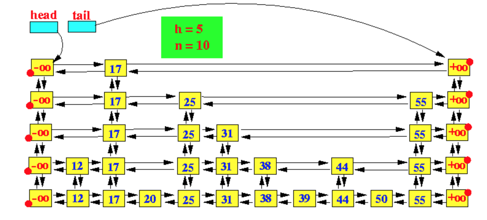

# Skip Lists

## Introduction

A [**skip list**](https://en.wikipedia.org/wiki/Skip_list]) is a randomized
data structure that allows for *O(log n)* search, insert, and delete.

Like a balanced BST, it offers the fast searches of a sorted array, 
while maintaining a structure that allows fast insertions which maintain sorted order 
(not possible in an array).

The idea of the skip list is relatively simple. 
We maintain a hierarchy of linked lists, referred to as the **layers**. 
The bottom-most layer is a sorted linked list containing all the elements, 
and each higher layer is a progressively less dense sorted linked list that acts as an 
"express lane" for searching. A diagram is given below:

## Operations

Pseudocode for each skip list operation is given below.

### Search

> 1. Begin at the head element in the top list, and proceed horizontally
(to the right) until the current element's right neighbor is greater
than the target, *x*.
> 2. Append the current node to the output.
> 3. If we are not in the bottom-most layer, traverse down one layer from the current node and repeat.
> 4. If we are in the bottom-most layer, then return the output
(last node in each layer that we visited in our search for *x*).

This works as a helper function for all other operations.

### Contains

> Return True if the last element in `search(x)` has value *x*.

### Insert

> 1. Find the first element *y* in the bottom-most layer of the skip list that is smaller than *x*, 
i.e. use `search(x)`.
> 2. Let *r* be the current right neighbor of *y*.
> 3. Rearrange pointers so that *y* points right to *x*, *x* points right to *r*, 
> *x* points left to *y*, and *r* points left to *x*.
> 4. While a random coin flip with heads probability *p* comes up heads,
and the current layer is less than or equal to the height,
>    1. Add *x* in the correct position in the next layer up by rearranging pointers appropriately.
>    2. Move up a layer.

Note: We can find the correct position at which to insert *x* for any layer by noting that 
*x* must be inserted exactly to the right of the corresponding node returned by `search(x)`.

### Remove

> Find all occurrences of *x* by running `search(x)` and rearrange pointers appropriately 
> so that no node points to an element with value *x*.

## Implementation

Please complete the skip list implementation in `skip_list.py` by filling in the TODOs
for the above operations.
A linked list data structure is also provided.

You can test your code with pytest or the driver code in `main.py`.
