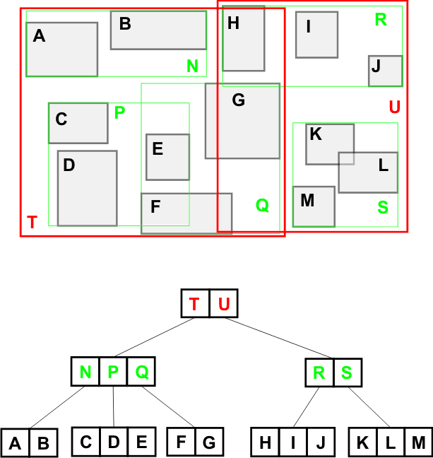

# R-Trees

The [R-tree](https://en.wikipedia.org/wiki/R-tree) can be thought of as a generalization of the 
B-tree to higher dimensions. 
It is commonly used as a [spatial index](https://en.wikipedia.org/wiki/Spatial_database#Spatial_index), 
to answer queries such as "which of these points are located within a given polygon?". 

One of the most famous usages of the R-tree (and its many variants) is in 
[PostGIS](http://postgis.net/workshops/postgis-intro/indexing.html), 
a popular extension to PostgreSQL databases which adds support for spatial indexing and queries.

Implementation details may differ, but for our purposes, the R-tree works as follows:
- There are two types of nodes: leaf nodes and internal nodes.
- Leaf nodes store the individual geometries which are inserted into the tree. 
Geometries can be points, lines, polygons, or higher-dimensional objects.
For example, a leaf node might store several 2D points.
- Internal nodes hold pointers to several child nodes, which may be leaves or other internal nodes.
- Every node keeps track of its axis-aligned 
[minimum bounding box](https://en.wikipedia.org/wiki/Minimum_bounding_box), also known as a 
minimum bounding rectangle in the 2D case.
For leaves, this is formed from their geometries.
For internal nodes, this is formed from their children.

Most of the typical B-tree properties are also satisfied:
- Each internal node has between *m* and *2m* children for some integer *m*.
- Similarly, each leaf holds between *m* and *2m* geometries.
- The root is exempt from the above rules. 
If it is a leaf (i.e. the only node), it can hold anywhere from 0 to *2m* geometries.
If it is an internal node, it should have between 2 and *2m* children.
- All leaves are at the same distance from the root. 
Unlike a B-tree, all inserted keys (geometries) are stored in this bottom layer, 
since internal nodes only hold bounding boxes formed from the union of multiple geometries.

In the image below, you can see several atomic geometries (*A* through *M*) held in leaf nodes,
as well as a number of bounding boxes representing internal nodes (*N* through *U*):


## Operations

For this assignment, you will implement the R-tree's insertion, splitting, and search operations. 
Please complete the method marked `TODO` in `rtree.py`.

You may use the Wikipedia article on R-trees and 
[this paper](https://tildesites.bowdoin.edu/~ltoma/teaching/cs340/spring08/Papers/Rtree-chap1.pdf)
as references.
A B-tree implementation is also included in `btree.py` for reference.

### Insertion

Insertion is fairly similar to regular B-tree insertion, with a couple of important differences.

First, there is no objectively correct place to put a given geometry. 
This is because when operating in more than one dimension, there is no one way to order the keys, 
the way that we can with points along a number line using the BST property.
In theory, a geometry can be added to any leaf which has space, and the leaf's bounding box will be 
enlarged to accommodate it.

However, the R-tree is most effective as a spatial index when we have small bounding boxes 
with minimal overlap. 
Therefore, we typically apply a heuristic during insertion: we navigate into the subtree whose 
bounding box requires the **minimum enlargement** (in terms of area) in order to fit the new geometry. 

Once we reach a leaf, we add the geometry and update the bounding box of the leaf and all its 
ancestors. If the leaf is full, we split it into two leaves underneath the same parent. 
If the parent is full, we split the parent as well, and so on.

### Splitting

Splitting a node works similarly for both leaves and internal nodes. 
It is only valid to do this if the node is full (holding *2m* geometries/children).

We look at its geometries (for internal nodes, we use the bounding boxes of its children), 
and find the two which are farthest apart (the maximum shortest distance between any two bounding boxes). 
We create two new nodes of the same type as the original node, and add one geometry/child to each. 

Finally, we run a greedy loop over the remaining geometries/children, 
adding each to one of the two new nodes using the minimum enlargement heuristic. 
We may need to truncate the loop in order to ensure that both new nodes end up with at least *m* 
geometries/children.

The new nodes should be given the same parent as the original node, which should be removed. 
Bounding boxes should be updated as needed.

### Searching

Querying an R-tree is relatively easy. 
There are multiple types of query, but the one we will consider is 
"which geometries are contained inside this query region?".

The query can be written recursively. 
Since we do not have the BST property, we must check each child's bounding box to decide 
which children to recurse into.
The base case is when we reach a leaf node, where we return any geometries in the query region.

## Dependencies
[Shapely](https://shapely.readthedocs.io/en/stable/project.html), a geometry library for Python,
is used to represent geometric objects in this assignment.
You may consult the documentation for this library and use functions from it to help you implement parts
of the R-tree data structure.
You can install it with:
```
pip install shapely
```
